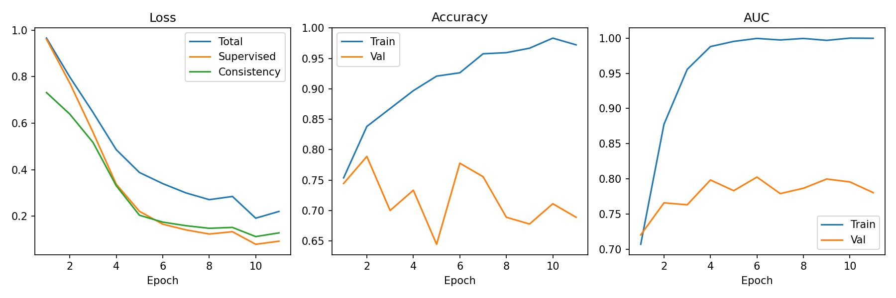

# Semi-Supervised Lesion Classification
***Colaboration with [UrMBCMRabbont](https://github.com/UrMBCMRabbont)***
*The Final Project 1 of HKUST ELEC4010N - Artificial Intelligence for Medical Image Analysis*

## Modernized Implementation
- Backbone: ConvNeXt-Tiny (ImageNet pretrained)
- SSL: FixMatch for binary classification (weak/strong aug views; pseudo-labels from weak view; supervised + unsupervised losses)
  - Pseudo-label gating: confidence thresholding with scheduled base `tau` and optional asymmetric thresholds (`tau_pos`/`tau_neg`)
  - Optional distribution alignment (EMA-matched prior) + probability sharpening
  - Optional FlexMatch-style adaptive thresholds; optional soft pseudo-label weighting
  - Unlabeled ratio `mu` and ramped unsupervised weight `lambda_u`
- Loss: `BCEWithLogitsLoss(pos_weight=...)` or focal loss on logits (`gamma`, `alpha`); optional bias init from class prior
- Optimization: AdamW with param-grouped weight decay (no decay for bias/norm), layer-wise LR decay, and head LR multiplier
  - LR schedule: warmup + cosine decay; AMP + grad clipping
- Evaluation: Acc / ROC-AUC / AP from sigmoid probabilities; EMA weights applied for validation; early stopping + checkpoint selection can target AUC or AP



## Comparison (Old vs Modernized)

| Aspect | Original Implementation | Modernized Implementation |
|---|---|---|
| Backbone | ResNet (baseline in notebook) | ConvNeXt-Tiny (ImageNet pretrained) |
| SSL method | Mean Teacher (consistency with EMA teacher) | FixMatch (weak/strong augmentations + thresholded pseudo-labels) |
| Pseudo-label control | N/A | `tau` schedule; optional asymmetric thresholds; optional FlexMatch adaptive thresholds; optional distribution alignment + sharpening |
| Imbalance handling | Upsampling/augmentation in notebook | Weighted sampling on labeled loader; loss reweighting via `pos_weight` or focal `alpha` |
| Optimization | Standard optimizer setup | AdamW with bias/norm no-decay, layer-wise LR decay, head LR multiplier, warmup + cosine schedule |
| Stabilization | EMA teacher model | EMA weights for evaluation; AMP + grad clipping |
| Metrics | Accuracy / AUC (reported) | Accuracy / ROC-AUC / AP (logged each epoch) |


## Original Implementation
Implementing semi-supervised binary classification on a dermoscopic lesion dataset by Mean Teacher model and ResNet.

For more high-level details, read the Project 1 part of the [presentation slides](./Presentation.pdf) and the [report](./Report.pdf).

Results:
- Validation accuracy: 80.00%
- Validation AUC: 0.6648

These results are compared with the baseline:
- Validation accuracy: 81.13%
- Validation AUC: 0.5402

Note that this dataset has a class imbalance problem, so it is likely to have high validation accuracy with low or high validation AUC. More tunings might produce better results.

## Prerequisites
Download and unzip data from the following links:
- [ISBI2016_ISIC_Part3_Training_Data.zip](https://isic-challenge-data.s3.amazonaws.com/2016/ISBI2016_ISIC_Part3_Training_Data.zip)
- [ISBI2016_ISIC_Part3_Training_GroundTruth.csv](https://isic-challenge-data.s3.amazonaws.com/2016/ISBI2016_ISIC_Part3_Training_GroundTruth.csv)

Place the files into the main directory. Alternatively, run the following commands in the notebook:

```python
!wget https://isic-challenge-data.s3.amazonaws.com/2016/ISBI2016_ISIC_Part3_Training_Data.zip
!wget https://isic-challenge-data.s3.amazonaws.com/2016/ISBI2016_ISIC_Part3_Training_GroundTruth.csv
!unzip "./ISBI2016_ISIC_Part3_Training_Data.zip"
```

Install the additional library by `pip install -U albumentations`.

These parts are included in the first code cell in the notebook.

Note that the test data are not used in this project. However if need, the test data can be accessed from the links:
- [ISBI2016_ISIC_Part3_Test_Data.zip](https://isic-challenge-data.s3.amazonaws.com/2016/ISBI2016_ISIC_Part3_Test_Data.zip)
- [ISBI2016_ISIC_Part3_Test_GroundTruth.csv](https://isic-challenge-data.s3.amazonaws.com/2016/ISBI2016_ISIC_Part3_Test_GroundTruth.csv)

## Notebook Outline
0. For Colab
1. Import
2. Data Loading
3. Data Preprocessing and Dataloaders
    1. Upsampling
    2. Augmentation
    3. Dataloaders
4. Building Models
    1. ResNet-50
    2. BCE Focal Loss
    3. Mean Teacher Model
5. Training
6. Results

## Reference
Tarvainen, A., Valpola, H. (2017). Mean teachers are better role models: Weight-averaged consistency targets
improve semi-supervised deep learning results. *arXiv:1703.01780*
